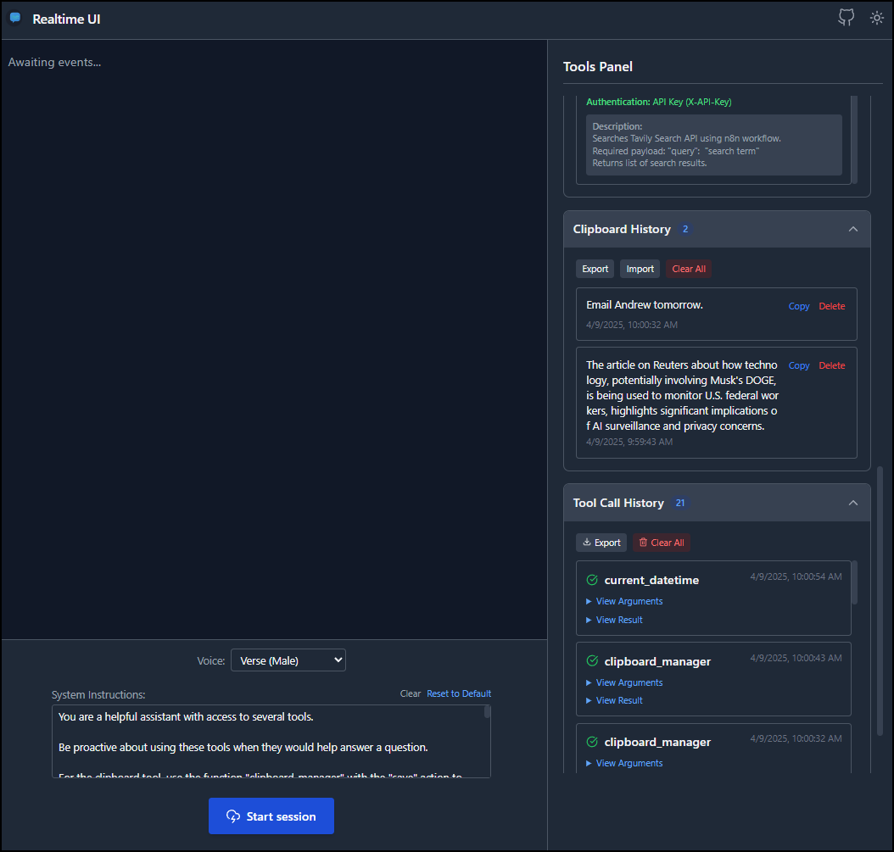

# OpenAI Realtime UI

A feature-rich web application for interacting with OpenAI's Realtime API, featuring a flexible tools system and universal webhook integration.


## Features

- 💬 Real-time chat interface with OpenAI's latest models
- 🔧 Extensible tools system to augment AI capabilities
- 🔍 Integrated web search capability
- 🪝 Universal webhook system to connect any API
- 🎨 Color palette generation tool
- 📋 Clipboard manager for saving and organizing information
- 🕒 Current date and time in multiple formats and timezones
- 🌐 Automatic proxy routing for external APIs (avoids CORS issues)
- 🎭 Dark/light mode themes

## Installation

### Prerequisites

- Node.js (v18+)
- An OpenAI API key with access to the Realtime API
- (Optional) A SearXNG instance for web search capability

### Setup

1. Clone the repository:
   ```bash
   git clone https://github.com/bigsk1/openai-realtime-ui.git
   cd openai-realtime-ui
   ```

2. Install dependencies:
   ```bash
   npm install
   ```

3. Create a `.env` file in the project root with your API keys:
   ```
   OPENAI_API_KEY=your_openai_api_key_here
   # Optional
   SEARXNG_URL=your_searxng_url_here 
   # Optional, set to mini model for lower cost
   # gpt-4o-mini-realtime-preview-2024-12-17
   OPENAI_REALTIME_MODEL=gpt-4o-realtime-preview-2024-12-17
   ```

4. Start the development server:
   ```bash
   npm run dev
   ```

5. Open your browser and navigate to `http://localhost:3000`




## Docker Setup

### Development Environment (Recommended)

For local development with hot reloading:

1. Clone the repository:
   ```bash
   git clone https://github.com/bigsk1/openai-realtime-ui.git
   cd openai-realtime-ui
   ```

2. Create a `.env` file with your API keys:
   ```
   OPENAI_API_KEY=your_openai_api_key_here
   # Optional
   SEARXNG_URL=your_searxng_url_here 
   # Optional, set to mini model for lower cost
   # gpt-4o-mini-realtime-preview-2024-12-17
   OPENAI_REALTIME_MODEL=gpt-4o-realtime-preview-2024-12-17  
   ```

3. Start the development container:
   ```bash
   docker-compose up -d --build
   ```

4. Access the application at http://localhost:3000

The development container mounts your local files, so any changes you make will trigger hot reloading.

### Model Selection

You can choose between different OpenAI Realtime models by setting the `OPENAI_REALTIME_MODEL` environment variable:

- `gpt-4o-realtime-preview-2024-12-17` (default): More powerful model
- `gpt-4o-mini-realtime-preview-2024-12-17`: Faster, lower cost model

## Tools System

This application features an extensible tools system that allows the AI to perform various actions beyond just conversation.

### Built-in Tools

- **Web Search**: Search the web for current information
- **Color Palette**: Generate color schemes based on themes
- **Webhook Call**: Universal tool to connect with any external API
- **Current DateTime**: Get precise date and time in various formats and timezones
- **Clipboard Manager**: Save and manage text snippets for easy recall and organization

### Webhooks Manager

The Webhook Manager allows you to configure custom API endpoints that the AI can interact with, without any coding:

1. Open the application and scroll to the "Webhook Endpoints Manager" section
2. Add new webhooks with:
   - **Endpoint Key**: A unique identifier for the webhook (e.g., `btc-price`)
   - **URL**: The API endpoint URL (e.g., `https://api.coingecko.com/api/v3/simple/price?ids=bitcoin&vs_currencies=usd`)
   - **Method**: The HTTP method to use (GET/POST/ANY)
   - **Authentication Method**: Choose the appropriate authentication for your API:
     - **No Authentication**: For public APIs that don't require authentication
     - **API Key**: Send an API key in a custom header (default: X-API-Key)
     - **Basic Auth**: Username/password authentication using the Basic scheme
     - **Bearer Token**: JWT or OAuth token authentication using the Bearer scheme
     - **Custom Header**: Any custom authentication header and value
   - **Description**: Detailed explanation of the webhook's purpose and required parameters, use payload to describe the data to send to the webhook.

All authentication credentials are stored securely in your browser's localStorage and are only sent to the specified API endpoints.

### Example Webhook Configurations

Here are some example webhook configurations for common APIs:

#### Weather API with API Key
```
Endpoint Key: weather
URL: https://api.weatherapi.com/v1/current.json
Method: GET
Auth Method: API Key
API Key Header Name: key
API Key: your_api_key_here
```

#### GitHub API with Bearer Token
```
Endpoint Key: github-repos
URL: https://api.github.com/user/repos
Method: GET
Auth Method: Bearer Token
Bearer Token: your_github_personal_access_token
```

#### Custom API with Basic Auth
```
Endpoint Key: private-api
URL: https://your-api.example.com/data
Method: GET
Auth Method: Basic Auth
Username: your_username
Password: your_password
```

### Current DateTime Tool

The Current DateTime tool provides precise time information in various formats and timezones. This is particularly useful for:

- Getting the exact current time in different timezones
- Formatting dates for various purposes (human-readable, ISO, UNIX timestamp)
- Including timestamps in documents or data analysis
- Time-sensitive tasks where accuracy is important

#### Using the Current DateTime Tool

The AI can retrieve time information using the following parameters:

- **Format**: Choose from several time formats
  - `iso`: ISO 8601 format (default)
  - `human`: Readable format with day, date, and time
  - `unix`: UNIX timestamp (seconds since epoch)
  - `date`: Date only in long format
  - `time`: Time only with timezone

- **Timezone**: Select from common timezones
  - `local`: Browser's local timezone (default)
  - `utc`: Coordinated Universal Time
  - `est`: Eastern Standard Time (US)
  - `cst`: Central Standard Time (US)
  - `mst`: Mountain Standard Time (US)
  - `pst`: Pacific Standard Time (US)

Example prompts:
- "What's the current time in UTC?"
- "Give me the current date and time in human-readable format"
- "I need a UNIX timestamp for right now"

### Clipboard Manager

The Clipboard Manager provides a convenient way to save and organize text content during your conversations with the AI. This feature is particularly useful for:

- Saving important information for later reference
- Collecting multiple pieces of information during a session
- Organizing research findings, code snippets, or summaries

#### Using the Clipboard Manager

The AI can interact with the clipboard using the following commands:

- **Save text**: `clipboard_manager` with `save` action
- **List saved items**: `clipboard_manager` with `list` action 
- **Get a specific entry**: `clipboard_manager` with `get` action and an entry ID
- **Delete an entry**: `clipboard_manager` with `delete` action and an entry ID
- **Clear all entries**: `clipboard_manager` with `clear` action

All clipboard entries are stored locally in your browser and persist between sessions. You can also export and import your clipboard history for backup or transfer to another device.

Example prompts:
- "Save this research summary to the clipboard"
- "Show me all the items in my clipboard"
- "Get the information I saved earlier about climate change"

## Advanced Features

### Automatic Proxy Routing

All external API requests are automatically routed through the application's built-in proxy to prevent CORS issues, with no configuration needed.

### Chaining Tools

The AI can automatically chain multiple tools together. For example, when asking about weather in a city:
1. First uses the geocoding webhook to convert the city name to coordinates
2. Then uses the weather webhook with those coordinates to get the forecast

## Development

### Project Structure

```
├── client/           # Front-end React application
│   ├── components/   # React components
│   ├── lib/          # Client-side utilities and tools definitions
│   └── styles/       # CSS and styling
├── docs/             # Documentation
├── server.js         # Express server and API endpoints
├── Dockerfile        # Docker configuration
├── docker-compose.yml # Docker Compose configuration
└── .env              # Environment variables (create this)
```

### Adding New Tools

See [docs/tools-guide.md](docs/tools-guide.md) for detailed instructions on how to create new tools and extend the application's capabilities.